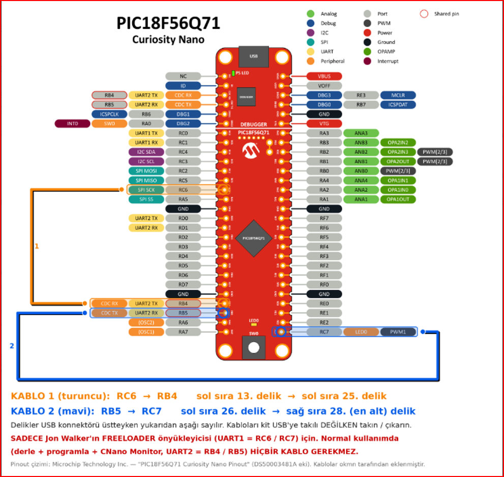
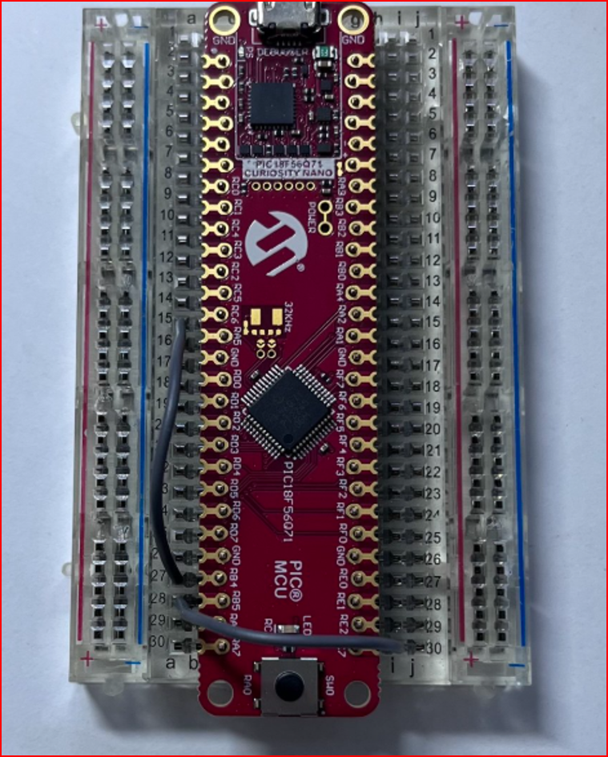

# CNanoKit – PIC18F56Q71 Curiosity Nano + Positron8

Compile, program and talk to Microchip's **PIC18F56Q71 Curiosity Nano (EV01G21A)** with one key from **Positron Studio**, **Proton IDE** or **VS Code** – no MPLAB X, no programmer, no wires, no bootloader. CNanoKit uses the kit's own on-board debugger through Microchip's free *pymcuprog*.

**Web page:** https://onderk.github.io/CNanoKit/ · **Forum topic:** [protoncompiler.com](https://protoncompiler.com/index.php/topic,3440.0.html) · **Download:** [latest release](https://github.com/onderk/CNanoKit/releases/latest) → `CNanoKit_v1.1_*.zip`.

## What you get
- **One key** compiles, programs, verifies and resets the kit: Positron Studio **F10** · Proton IDE **Program (CNanoProg)** button · VS Code **Ctrl+Alt+M** (or Ctrl+Alt+C, then Ctrl+Alt+P).
- It refuses to write if the kit's PIC differs from your `Device =` line.
- **CNano Monitor** (EN/TR): Text/HEX view and send, quick buttons, Reset PIC, log file.
- Your program uses **UART2 (RB4 = TX, RB5 = RX)** – already wired inside the kit to its USB port.
- Three examples in `examples/`: HELLO, HELLO_NOLED, KOMUT.

## What your PC needs (tested)
Windows 10/11 64-bit · Positron8 4.0.6.4 · one IDE: Positron Studio 2.1.0.4 / Proton IDE 2.0.3.3 / VS Code 1.140 + "Positron" extension by atomix 2.9.0 · Python 3.14.7 64-bit ("Add python.exe to PATH") · internet once for the setup (installs Microchip pymcuprog and the PIC18F-Q device pack).

## Quick start
1. Download the release zip → right-click → Properties → **Unblock** → unzip to `C:\CNanoKit`.
2. Close your IDEs, run `CNanoProg_Setup.bat`.
3. Plug in the kit (USB **data** cable), open `examples\CNANO_HELLO_56Q71.bas`, compile + program, open the monitor.
Step by step: [docs/NEW_PC_SETUP_EN_02102026_1240.md](docs/NEW_PC_SETUP_EN_02102026_1240.md) · full guide: [docs/INSTALL_EN_01102026_2030.md](docs/INSTALL_EN_01102026_2030.md)

## Videos (English captions)

### 1 · CNanoKit – for everyone (start here)
Pick your IDE and watch top to bottom: **HELLO** first (checks your setup), then **HELLO_NOLED** (text only), then **KOMUT** (PC → PIC commands).

| Order | Positron Studio | Proton IDE | VS Code |
|---|---|---|---|
| 1 · HELLO – compile, program, monitor | [▶ watch](https://youtu.be/5oV3hNFtrQQ) | [▶ watch](https://youtu.be/HoQPmnRP7GU) | [▶ watch](https://youtu.be/9kIeRDDFuoc) |
| 2 · HELLO_NOLED – text only | [▶ watch](https://youtu.be/Fr_1ISsT9pI) | [▶ watch](https://youtu.be/7u8eBAA3DyQ) | [▶ watch](https://youtu.be/gBkqgx5eyXM) |
| 3 · KOMUT – control the PIC from the PC | [▶ watch](https://youtu.be/_-PZj2wlwPs) | [▶ watch](https://youtu.be/cnKvcF5cFHo) | [▶ watch](https://youtu.be/dkm4jyVHdmw) |

4 · **CNano Monitor tour** – Text/HEX view, quick buttons, Reset PIC (same in every IDE): [▶ watch](https://youtu.be/-UH7H_6zfKo)

### 2 · JonW's mwboot bootloader on this kit (tests – separate from CNanoKit)
JonW's free FREELOADER/mwboot bootloader also runs on this kit with two wires. 
**Wiring (only for JonW's bootloader – CNanoKit itself needs no wires):** wire 1 **RC6 → RB4**, wire 2 **RB5 → RC7**. Fit/remove the wires with USB unplugged. With wire 2 fitted, your program must never drive RC7 (LED0).

 

*Diagram text is Turkish: "KABLO 1 (turuncu)" = wire 1 (orange), "KABLO 2 (mavi)" = wire 2 (blue), "sol/sağ sıra N. delik" = left/right row, hole N (counted from the USB end). Pinout drawing: Microchip Technology Inc. (DS50003481A); wires added by okmn.*

Watch in order:

| Part | Video |
|---|---|
| 1 · Upload an app through the bootloader | [▶ watch](https://youtu.be/DtCk0OLhyhg) |
| 2 · Reading the whole chip back (R command) | [▶ watch](https://youtu.be/RV5UpDS18VI) |
| 3 · Why FREELOADER 1.1 can't connect yet (DTR) | [▶ watch](https://youtu.be/Hw0ExDGAQg8) |
| 4 · The test app on its own (no bootloader) | [▶ watch](https://youtu.be/YuMxKAdu_NI) |

Notes: [docs/JonW_mwboot_on_Curiosity_Nano_EN_03102026_1910.md](docs/JonW_mwboot_on_Curiosity_Nano_EN_03102026_1910.md) · forum topic: https://protoncompiler.com/index.php/topic,3427.0.html

## Not included
Breakpoint debugging (use MPLAB X for that). Other kits are not tested.

## Türkçe
Türkçe kılavuzlar: [docs/YENI_PC_KURULUM_TR_02102026_1240.md](docs/YENI_PC_KURULUM_TR_02102026_1240.md) · [docs/KURULUM_TR_01102026_2030.md](docs/KURULUM_TR_01102026_2030.md)

---
Freeware: free to use, do not modify or redistribute modified versions (see LICENSE.txt). No warranty. Positron8, Positron Studio and Proton IDE are products of their authors; CNanoKit only adds settings and uses Proton IDE's documented Plugin Manager files. Feedback: [CNanoKit forum topic](https://protoncompiler.com/index.php/topic,3440.0.html) (user okmn).
